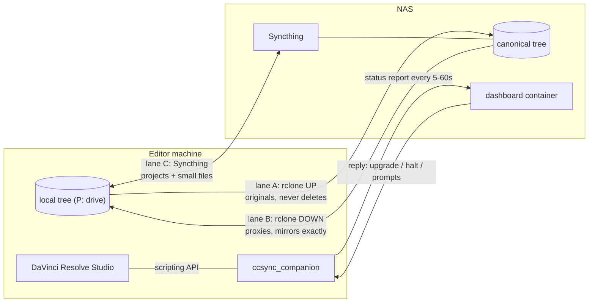
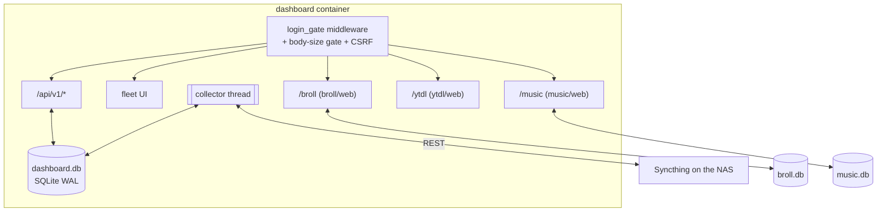
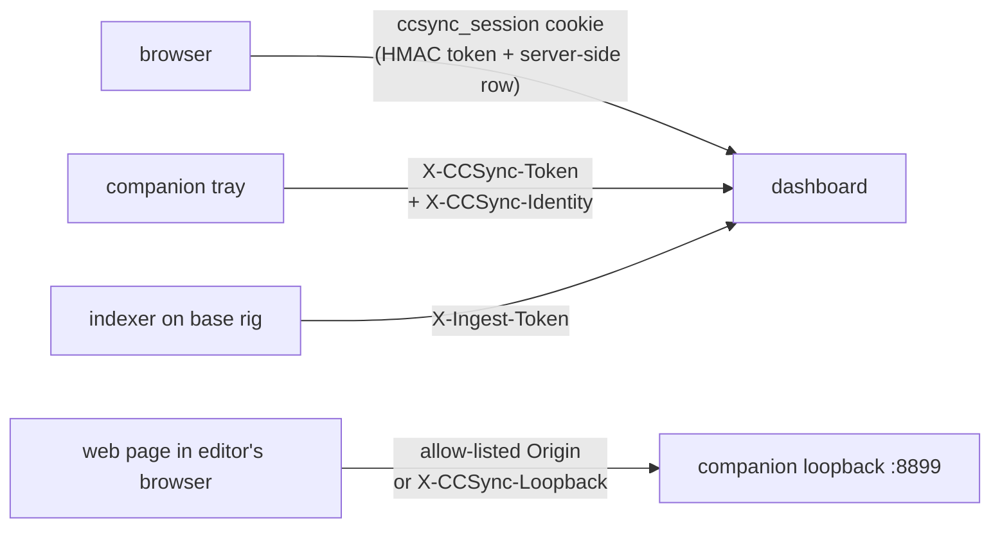
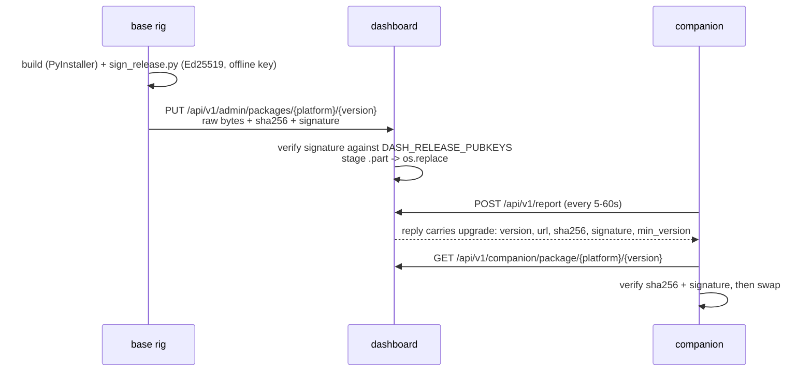
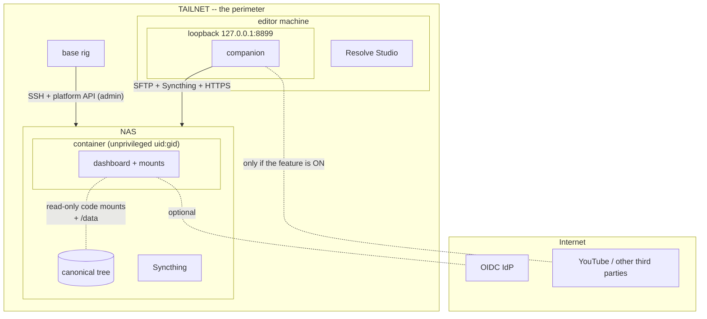

# Architecture

CC Sync — fleet sync for DaVinci Resolve®. This is the system overview for
someone who has never seen the repository: what the pieces are, where each one
runs, how footage and status move between them, and where the trust boundaries
sit.

Written 2026-08-17 (`COMMERCIAL_READINESS.md` item 13). The internal
architecture document with the full history and rationale is `SPEC.md` at the
repo root; the live defect ledger is `KNOWN_BUGS.md`. This file is the
stranger's map.

---

## 1. The problem it solves

A studio's DaVinci Resolve projects live on one NAS. Editors are not in the
building. Resolve's own collaboration expects a LAN. Media is too big to
mirror wholesale, and Resolve stores **absolute paths** in projects, so a
project that opens fine on one machine is a wall of "Media Offline" on
another.

CC Sync makes the NAS tree the single source of truth, mounts it at the same
path spelling everywhere (`P:\` on Windows, by an explicit decision), syncs a
*slice* of it to each editor, and runs an agent on every machine that keeps
Resolve, the filesystem and a dashboard telling the same story.

---

## 2. Components, and where they run

| Directory | What it is | Runs where |
|---|---|---|
| `companion/` | `ccsync_companion` — the editor tray app: three sync lanes, the Resolve watcher/fixer/popup, proxy generation, the LUT link, the upgrade-channel client, and the loopback server on `127.0.0.1:8899` | every editor machine, and the base rig; frozen with PyInstaller |
| `dashboard/` | `ccsync_dashboard` — FastAPI fleet dashboard: sync status, transfers, project provisioning, admin | a Docker container on the NAS |
| `server/` | install/setup scripts that build the NAS side over SSH + the platform API | the base rig, aimed at the NAS |
| `installer/` | per-OS editor bootstrap: drive mapping, companion install, Resolve prefs | editor machines |
| `onboarding/` | the first-run wizard (`onboard.exe`, and a macOS app) | editor machines |
| `broll/` | the b-roll platform: `web/` search UI + API, `indexer/` clip indexing, `eval/` | web mounted in the dashboard; indexer on the base rig |
| `music/` | the music tagger: `web/` CLAP search UI + API, `indexer/`, `eval/` | web mounted in the dashboard; indexer on the base rig (needs the GPU) |
| `ytdl/` | the YouTube downloader page + fleet job queue | mounted in the dashboard, **only when the feature is on** |
| `bench/` | `ccbench`, a sync-engine benchmark harness | ad hoc |
| `tools/` | release, signing, drift-check and key tooling | the base rig |

Four machine roles exist, and it is worth naming them because the docs assume
you know which one you are on:

- **The NAS** — canonical tree, dashboard container, Syncthing, SFTP.
- **The base rig** — an operator workstation with *direct* access to the share.
  It runs the install and release tooling and the GPU indexers, and it runs
  the companion in `mode = "base"` (no sync lanes; its `local_root` **is** the
  NAS tree).
- **Editor machines** — remote, sync a slice, run Resolve Studio.
- **The IdP / Tailscale control plane** — third-party, if used.

---

## 3. The three sync lanes

Every byte moves on exactly one of three lanes, and which lane carries a file
is decided by its extension and its position in the tree. That split is not a
tuning knob: three copies of the video-extension list exist (companion,
dashboard, server) and a cross-component test pins them byte-identical,
because a media type carried by both lanes or by neither is a data bug.



| Lane | Transport | Direction | Carries | Safety property |
|---|---|---|---|---|
| **A** | rclone over SFTP | editor → NAS | originals the editor added | **Never deletes on the NAS.** Skip-if-exists, so last-writer-wins cannot clobber. A reorganisation must therefore happen on the server side or stale copies accumulate |
| **B** | rclone over SFTP | NAS → editor | `**/Proxy/**` only | `rclone sync` — it **mirrors**, so it deletes locally. Guarded by a circuit breaker (below) and everything it removes goes to `.ccsync-trash` first |
| **C** | Syncthing | bidirectional | project files, session data, small assets — `.stignore` excludes video and `Proxy/` | Server-side staggered file versioning is the deletion safety net; conflicts become conflict-copies and are surfaced in the tray |

### The safety latches on top

These exist because a sync engine's failure mode is *deleting the customer's
footage*, and they are documented in full in [`SYNC_SAFETY.md`](SYNC_SAFETY.md):

- **The lane B circuit breaker.** A pass that would delete more than
  `lane_b_max_deletes_per_pass`, more than `lane_b_max_delete_fraction` of the
  local tree, or that sees the remote shrink past
  `lane_b_remote_shrink_fraction`, **trips and stops** instead of mirroring the
  loss. A tripped breaker is reported to the dashboard as an alarm — a machine
  in that state looks perfectly healthy on every other field.
- **`.ccsync-trash`**, with age and size retention, so "lane B deleted it" is
  recoverable for days rather than instantly.
- **The fleet halt.** One admin switch that stops every companion in the fleet
  (§6). Deliberately not per-machine: the case it exists for is "something is
  destroying files and I do not yet know which machine".
- **Resolve edit backups.** Before the companion changes any clip path, it
  writes an undo record under `~/.ccsync/resolve_edits/` —
  [`RESOLVE_EDIT_SAFETY.md`](RESOLVE_EDIT_SAFETY.md).
- **Snapshot before privileged operations**, on the NAS side —
  [`BACKUP_RESTORE.md`](BACKUP_RESTORE.md).

---

## 4. The dashboard, and its mounts

One FastAPI process in one container. It serves:

- the fleet UI (server-rendered + htmx),
- `/api/v1/*` (see [`API.md`](API.md)),
- and up to three **mounted sub-applications**.



The mounts are **in-process, behind the dashboard's login**, and each is
best-effort:

- **`/broll`** (`dashboard/src/ccsync_dashboard/broll.py`) — the b-roll search
  UI, with its own fail-closed ingest-token gate for the indexer's write path.
  On by default at deploy time (`DASH_BROLL_ENABLED`).
- **`/music`** (`music.py`) — in-process specifically so the audio route's
  Range/206 responses are not proxied. There is deliberately **no**
  `DASH_MUSIC_ENABLED`: ship the tree or don't.
- **`/ytdl`** (`ytdl.py`) — mounted **only** when
  `[features] youtube_download` is on.

Three rules hold for all three, and they are load-bearing:

1. **A broken or absent mount must never stop the dashboard booting.** Each
   `mount_*` returns `mounted` / `absent` / `degraded` / `disabled`, and only a
   fully working mount is advertised in the nav.
2. **Frontend URLs are document-relative.** A root-relative `/api|/media|/static`
   URL in a mounted SPA breaks it under its prefix; both `broll/web` and
   `music/web` have a test that pins this.
3. **The music package is `musicweb`, not `app`.** `broll/web` is deployed by
   putting its tree on `PYTHONPATH` and importing it as top-level `app`; a
   second package of that name would collide in `sys.modules`.

An in-process **collector thread** polls Syncthing's REST API on staggered
cadences (connections 15s, completion 60s, config 120s, provisioning 300s,
inventory 900s) and reconciles folder shares against the tick table. Two of
those intervals are deliberately slow and say why in the code: the inventory
walk and the completion poll both consume CPU on the box that is simultaneously
serving SFTP and Syncthing.

---

## 5. The auth model

Four credentials, three of them at once on a normal editor machine.



**Browser sessions.** Sign-in verifies a NAS password by SMB session setup on
:445 (`DASH_AUTH_METHOD=smb`) or via OIDC. The cookie is a versioned HMAC
token *and* has a server-side row keyed by `HMAC(secret, cookie)` — a cookie
with no row is not a session, which is what makes logout, "log out everywhere"
and an admin's revoke button mean anything. `HttpOnly`, `SameSite=Lax`,
`Secure` per `DASH_COOKIE_SECURE`. 12h idle / 7d absolute. Login is throttled
per-username *and* per-IP, in SQLite so it survives the restart every deploy
performs. State-changing requests carrying the cookie need a CSRF synchroniser
token derived from the session id.

**Companion report tokens.** Two kinds:

- the **shared** `DASH_REPORT_TOKEN`, held by every deployed companion. It
  proves "somebody in this fleet" and nothing more;
- **per-editor** tokens (`cce1.<id>.<secret>`), minted on the Users page,
  stored hashed, revocable one at a time, and **bound** — a report or a
  selection read under one may not claim another editor's identity.

The shared token is kept only for migration. `DASH_SHARED_REPORT_TOKEN_ENABLED=0`
retires it, and the Users page shows how many machines still authenticate with
it so an operator knows when that is safe.

**Machine identity tokens.** Signing in from the tray calls `POST /api/v1/verify`
and gets a 30-day signed token stating *whose machine this is*. `/api/v1/report`
and the selection routes require it alongside the shared token — without it,
any holder of a shared secret could overwrite any editor's presence rows.

**Scoping.** `auth.Scope` decides what a viewer sees: non-admins are locked to
their own editor identity across projects, transfers, editors and presence
views; admins see the fleet and may focus one editor with `?as=<editor>`. The
one route that answers actual file paths — "what is missing from *this*
person's machine" — answers **404, not 403**, to a caller outside its scope.

**Admins** come from `DASH_ADMIN_USERS`. Under OIDC, `DASH_OIDC_ADMIN_CLAIM` is
logged, not obeyed.

---

## 6. The site manifest

`site.toml` at the repo root is **who this deployment is**: NAS address and
admin user, tree paths, share names, bind addresses, rclone tuning, Syncthing
GUI URL and device id, the org's display name, the feature switches, and the
editor-account / ACL posture. Before 2026-08-17 these were literals in
`server/common.py`, which made a second deployment a fork rather than a config
change.

Two consumers:

- **The server scripts** read the file directly (`server/common.py`
  `load_site()` / `site_value()`), search order `--site` → `$CCSYNC_SITE` →
  `<repo>/site.toml`.
- **The dashboard never reads the file** — and, since `ZERO_TOUCH_PLAN.md` WP D
  (2026-08-17), the manifest it serves is **DB-first**, not env-first. Every
  deployment still starts the same way: `install_dashboard_app.py` (or a hand
  edited compose) projects the non-secret half into `DASH_SITE_*` environment
  variables. But `GET /api/v1/site` — still *open*, on the same terms as
  `/api/v1/health`, for the same reason: the installer, the onboarding wizard
  and the companion all read it before anyone has logged in — now resolves
  each field through `site_store.resolved_manifest`: **a `site_settings`
  table row wins if one exists, else the `DASH_SITE_*` value, else the
  built-in default.** The table starts empty on every existing deployment, so
  this is invisible until an admin visits **Settings**
  (`/admin/settings`, `PUT /api/v1/admin/site`) — which is the point: an
  appliance customer with no shell can now set the manifest from the browser,
  survives a redeploy (it is `/data`, not compose env), and needs no
  `--recreate`. A one-time seed copies `DASH_SITE_*` into the table on first
  boot if the table is empty and the environment carries any of it, after
  which **the database is authoritative** — a later env change is not picked
  up automatically. `site.toml` itself is retired as a customer-facing
  interface by this same plan (§5); it survives only as an **export format**
  (Settings → Export produces `site.toml`-shaped text a NAS migration can
  paste back in on the other side).

Nothing secret may ever be added to that response. A Syncthing device ID is a
public key; every other value is an address the client is about to be handed
anyway. Every string defaults to `""`, never to another site's value — a blank
field means "this deployment has not been told", which a client can fall back
on, while a wrong-tenant default is a support incident nobody can see.

`schema` is a monotonic integer, not the dashboard version: clients across
three OSes upgrade at their own pace and check the shape they know.

The wizard behind this (`/setup`, task-driven, resumable across restarts) is
`ZERO_TOUCH_PLAN.md` §3.2/§3.5; the config surface (`site_settings`,
`secrets_boot.py`'s first-boot secret generation) is `CONFIG.md` §1.1.

Full key reference: [`CONFIG.md`](CONFIG.md).

---

## 7. The upgrade channel

The companion updates itself. That means the dashboard can hand every editor
machine an executable which is then renamed over the running tray app, so the
channel is signed end to end.



Properties worth knowing:

- **The private key never touches the repo or the NAS.** It lives at
  `%USERPROFILE%\.ccsync-release\release.key` (0600), overridable with
  `CCSYNC_RELEASE_KEY`. The dashboard holds only public keys, and uses them at
  publish time.
- **No key configured ⇒ publishing is refused with a 503 naming the variable.**
  It does not fall back to accepting unsigned builds.
- **"Different, not newer" is the update rule**, which makes republishing an
  older build a first-class rollback with no extra machinery.
- **`min_version` is a downgrade floor**; a companion below it will not accept
  the offer.
- An absent or unknown `platform` is offered **nothing** — coercing it to
  "windows" is how a macOS companion once got handed a Windows `.exe`.
- macOS bundles must be built on a Mac. PyInstaller does not cross-compile, so
  a Windows release run publishes no macOS artifact and prints an advisory.

Everything about running one: [`RELEASE.md`](RELEASE.md).

---

## 8. The loopback API

The tray app runs **one** HTTP listener on `127.0.0.1:8899`. A second process
holding that port breaks the tray, which is why the b-roll, music and ytdl
route groups all hang off the same server rather than three.

It is what makes "Send to Resolve" work from a web page: the page is served
from the NAS, but only the editor's own browser can reach the editor's own
Resolve — and only their companion knows where the library is on their disk.
So the request body carries `{action, share, rel_path}`, never a path.

A loopback bind is **not** an authorisation decision — every page in that
browser is on the same machine. Two ways in, and only two: an **allow-listed
Origin** (this deployment's dashboard URL, from config and from the cached site
manifest, in both http and https form), or the **loopback token** at
`~/.ccsync/loopback-token` presented as `X-CCSync-Loopback`, for callers that
are not a browser. Anything else gets 403 with no CORS headers at all, so the
calling page cannot even read the refusal.

Full contract: [`LOOPBACK_API.md`](LOOPBACK_API.md).

---

## 9. Trust boundaries



| Boundary | What it protects | How |
|---|---|---|
| **The tailnet** | everything | There is no public listener. The dashboard binds named NAS addresses (never `0.0.0.0`) or, on Synology, `127.0.0.1` with Tailscale Serve in front. Serve is the only supported TLS publish path |
| **The dashboard login** | fleet status, other editors' data | Session cookie or a bound companion token; scoped per editor |
| **The container** | the NAS | Runs as a non-root service uid:gid. Code trees are mounted **read-only**; only `/data` is writable. Its `.env` is 0600 root-owned. Prefer a scoped API key over the admin password so what is inside the container cannot create accounts at will |
| **Editor accounts on the NAS** | other editors' projects | `sftp-only` by default: nologin, `ForceCommand internal-sftp`, no password auth. `project_acl` decides whether editors are one shared group or per-project groups — [`TENANCY.md`](TENANCY.md) |
| **The loopback API** | the editor's Resolve session and desktop | Origin allow-list or a 0600 on-disk token; path containment checks on every `share`/`rel_path` |
| **The upgrade channel** | every machine in the fleet | Ed25519 signature verified at publish; sha256 + signature verified again by the client |
| **The Syncthing GUI** | every folder in the fleet | Bind it narrowly and put a login on it. It is an unauthenticated admin surface by default |

Two things that are explicitly **not** boundaries: the LAN (if you deploy
plain-HTTP on it, the LAN is the perimeter), and process isolation between
mounted SPAs and the dashboard (they run in the same process, on purpose).

---

## 10. What is stored where

| Store | Location | Holds |
|---|---|---|
| `dashboard.db` | `<apps root>/data/dashboard.db` in the container's `/data` | lane status, transfers, presence, projects, ticks, sessions, login throttle, per-editor report tokens, published packages, fleet halt. SQLite in WAL mode. **The only volume that survives a redeploy** |
| published packages | `<db dir>/packages` by default | the companion/onboard builds the fleet downloads |
| `broll.db` | shipped to the NAS beside the b-roll web tree | clip index, embeddings, transcripts |
| `music.db` | `music/web/data/music.db` on the NAS | audio embeddings, tags, axes, waveform peaks — all precomputed on the base rig |
| the canonical tree | `<pool_root>/<tree_name>/` | `Projects/` plus fixed product folders: `Assets/Luts`, `Assets/Stills`, `Assets/B-roll Archive`, `Assets/Music` |
| project identity | `.ccsync-project` marker (JSON) inside each project dir | the project's **immutable slug**. A directory is a project because it carries this, at any depth |
| editor state | `~/.ccsync/` | `config.toml`, `companion.log`, `identity.json`, `loopback-token` (0600), `state/site.json` (cached manifest), `resolve_edits/` (undo records), `crashes/`, `eula_accepted.json`, `known_hosts` |
| editor media | `P:\` (the mapped tree) | the slice of the tree this editor has ticked, plus `.ccsync-trash` |
| secrets | the operator's vault, and the container's 0600 `.env` | never in `site.toml`, never in the repo — [`SECRETS.md`](SECRETS.md) |

---

## 11. Data flow: one editor's day

```mermaid
sequenceDiagram
    autonumber
    participant E as Editor
    participant C as Companion
    participant D as Dashboard
    participant N as NAS tree
    E->>D: sign in, tick a project
    D->>D: collector shares the Syncthing folder with their devices
    C->>D: GET /api/v1/selection/<editor>
    C->>C: clone the project's directory skeleton locally
    C->>N: lane A -- upload originals the editor added
    N->>C: lane B -- pull **/Proxy/** for the ticked project
    C->>N: lane C -- Syncthing carries the project file itself
    E->>E: open the project in Resolve Studio
    C->>C: watch the timeline; repoint stale proxy paths; offer to fix out-of-tree media
    C->>D: POST /api/v1/report (lanes, presence, alarms)
    D-->>C: {"upgrade": ...}, {"commands": {"halt": ...}}, "this project has no root mapping"
```

---

## 12. The platform envelope

**v1 is deliberately narrow.** State these as product requirements rather than
discovering them at a customer site:

- **DaVinci Resolve Studio.** The coupling is deep by design — the Blackmagic
  Proxy Generator is driven through UI automation on `Resolve.exe -pg`, and
  collaboration and the scripting API do not exist in the free version.
- **TrueNAS SCALE 25.x or Synology DSM 7.2+.** Both are implemented behind a
  runtime seam (`dashboard/.../nas/`) and an install seam (`server/backends/`).
- **Tailscale, or your own TLS front-end.** Tailscale Serve is the supported
  publish path.
- **Windows and macOS editors.** macOS is code-complete; its builds require a
  Mac and its Mac editors historically lag a release behind.
- **One dashboard container per customer.** Multi-org is not a switch.

Deferred, and named so nobody mistakes them for oversights:

| Deferred | Why |
|---|---|
| **Linux editor client** | never built; only if a customer asks |
| **In-instance multi-tenancy** | architectural. One customer = one container is the answer today — [`TENANCY.md`](TENANCY.md) §1 |
| **A configurable drive letter** | `P:\` is hardcoded by an explicit decision (2026-07-26). The manifest *states* it so no client has to guess, but changing it is not supported |
| **Per-file lane A/B inventory on the server** | the NAS cannot see an editor's local trees; it would need the companion to report rclone `check` summaries |
| **A generic Linux NAS backend** | v2 candidate alongside the `ServerBackend` protocol work |

---

## 13. Further reading

- [`INSTALL.md`](INSTALL.md) — install it
- [`CONFIG.md`](CONFIG.md) — every configuration key
- [`API.md`](API.md) — the HTTP surface
- [`SYNC_SAFETY.md`](SYNC_SAFETY.md), [`BACKUP_RESTORE.md`](BACKUP_RESTORE.md),
  [`RESOLVE_EDIT_SAFETY.md`](RESOLVE_EDIT_SAFETY.md) — the safety story
- [`TENANCY.md`](TENANCY.md) — who can reach whose footage
- [`DOCKER.md`](DOCKER.md), [`CI.md`](CI.md) — how the container and the tests are built
- `SPEC.md` (repo root) — the internal architecture document, with the history
- [`README.md`](README.md) — the docs index

---

DaVinci Resolve is a registered trademark of Blackmagic Design Pty Ltd. CC Sync
is not affiliated with, endorsed by, or sponsored by Blackmagic Design.
